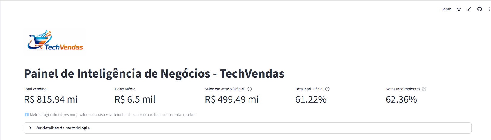
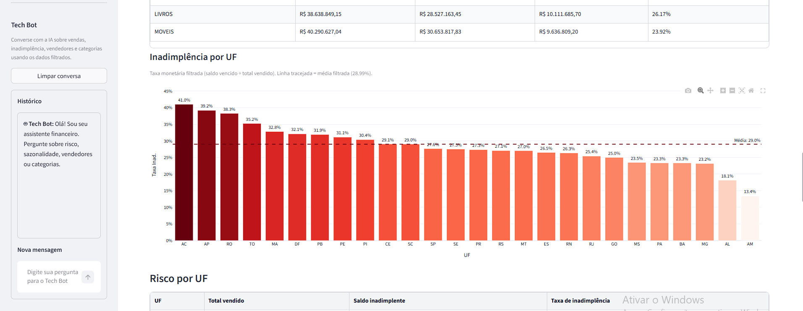
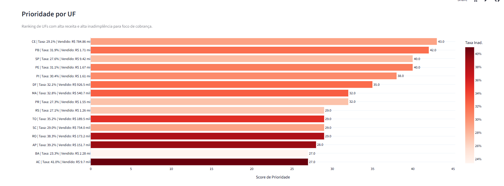

# TechVendas BI — Painel de Inteligência de Negócios

[](https://techvendas.streamlit.app/)


[](LICENSE)

Dashboard interativo para análise de vendas, inadimplência e priorização de cobrança, construído com Python, Streamlit e integração com IA generativa (Groq).

🔗 **[Acesse o app ao vivo → techvendas.streamlit.app](https://techvendas.streamlit.app/)**

---

## Visão Geral

Este projeto entrega uma solução de Business Intelligence ponta a ponta para a TechVendas, integrando dados transacionais de vendas e financeiro em uma única interface analítica. O painel permite que gestores tomem decisões baseadas em evidências, com destaque para:

- Monitoramento de receita e sazonalidade
- Análise de inadimplência por UF e segmento
- Priorização objetiva de ações de cobrança
- Recomendações geradas por IA (LLM via Groq)

---

## Demonstração

**🚀 App publicado:** [https://techvendas.streamlit.app/](https://techvendas.streamlit.app/)

> Também pode ser executado localmente seguindo as instruções abaixo.

---

## Screenshots







---

## Tecnologias

| Camada | Tecnologia |
|---|---|
| Interface | [Streamlit](https://streamlit.io) |
| Visualizações | [Plotly](https://plotly.com/python/) |
| Manipulação de dados | [pandas](https://pandas.pydata.org) |
| Banco de dados | PostgreSQL via [SQLAlchemy](https://www.sqlalchemy.org) + psycopg2 |
| IA generativa | [Groq API](https://console.groq.com) (LLM) |
| Gerenciamento de segredos | python-dotenv / Streamlit Secrets |

---

## Funcionalidades

- **KPIs financeiros:** total vendido, ticket médio, saldo em atraso e taxa de inadimplência oficial
- **Sazonalidade:** evolução mensal de vendas com gráfico de linha
- **Ranking de vendedores:** top performers com estimativa de comissão
- **Análise por categoria:** participação, lucro e margem por segmento de produto
- **Inadimplência por UF:** taxa percentual e score de prioridade de cobrança
- **Chat com IA:** chatbot contextual na sidebar, com acesso aos dados filtrados do dashboard
- **Tema claro/escuro:** alternância de tema integrada à interface

---

## Arquitetura

```
PostgreSQL (origem)
      │
      ▼
SQL + SQLAlchemy (extração)
      │
      ▼
pandas (tratamento + feature engineering)
      │
      ▼
Streamlit + Plotly (dashboard interativo)
      │
      ▼
Groq LLM (camada de IA para recomendações)
```

---

## Como executar localmente

### 1. Pré-requisitos

- Python 3.10+
- Acesso a uma instância PostgreSQL com os dados da TechVendas

### 2. Clone o repositório

```bash
git clone https://github.com/rodolfo026/TechVendas.git
cd TechVendas
```

### 3. Crie e ative o ambiente virtual

```bash
python -m venv venv

# Windows
venv\Scripts\activate

# Linux/macOS
source venv/bin/activate
```

### 4. Instale as dependências

```bash
pip install -r requirements.txt
```

### 5. Configure as variáveis de ambiente

Copie o arquivo de exemplo e preencha com suas credenciais:

```bash
cp .env.example .env
```

> Para obter uma chave da API Groq gratuitamente: [console.groq.com](https://console.groq.com)

### 6. Execute o app

```bash
streamlit run app.py
```

O dashboard abrirá automaticamente em `http://localhost:8501`.

---

## Deploy no Streamlit Cloud

1. Faça o fork/push para o seu GitHub
2. Acesse [share.streamlit.io](https://share.streamlit.io) e conecte o repositório
3. Em **Advanced settings → Secrets**, adicione as mesmas variáveis do `.env`
4. Clique em **Deploy**

---

## Estrutura do projeto

```
TechVendas/
├── app.py                        # Aplicação principal Streamlit
├── analise_inadimplencia.ipynb   # Análise exploratória em Jupyter
├── requirements.txt              # Dependências Python
├── .env.example                  # Template de variáveis de ambiente
├── .env                          # Credenciais locais (não versionado)
├── .gitignore
├── LICENSE
└── Logo.png
```

---

## Metodologia de Inadimplência

A taxa oficial é calculada sobre a tabela `financeiro.conta_receber`:

$$\text{Taxa de Inadimplência} = \frac{\text{Valor em Atraso}}{\text{Carteira Total}} \times 100$$

**Critério de atraso:** títulos com `data_recebimento` nula e `data_vencimento` anterior à data atual.

---

## Priorização de Cobrança por UF

Score combinado que considera simultaneamente risco e impacto financeiro:

$$\text{Score} = \text{rank}(\text{taxa inadimplência}) + \text{rank}(\text{total vendido})$$

UFs com alto volume e alta inadimplência recebem prioridade máxima de ação.

---

## Autor

**Rodolfo José** — [GitHub](https://github.com/rodolfo026)
